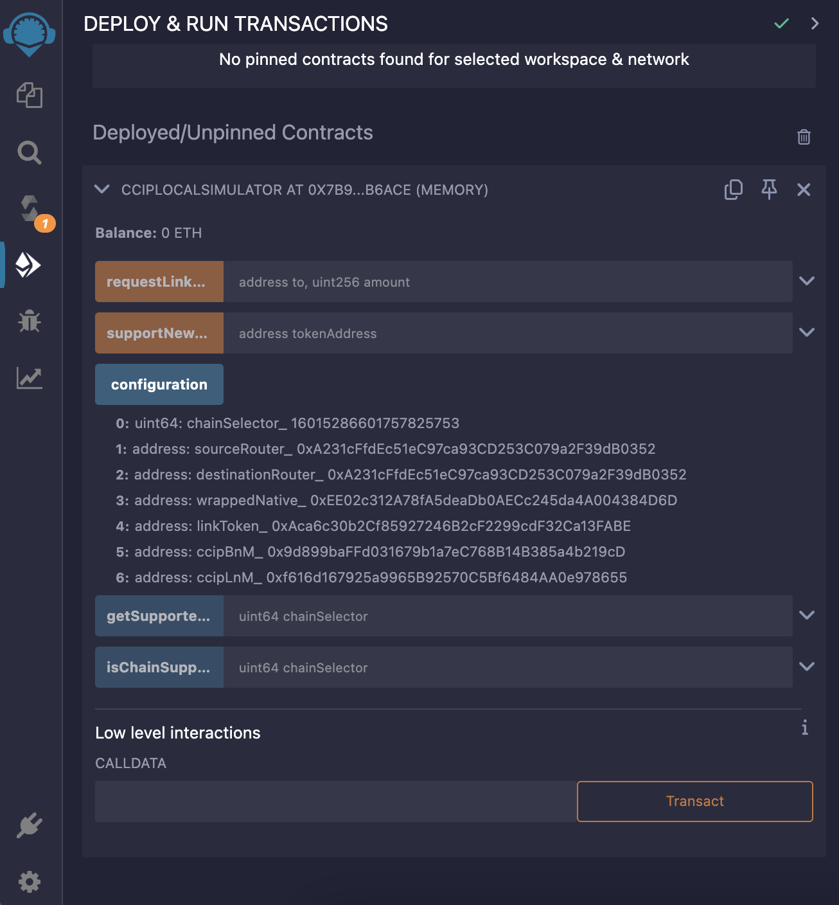
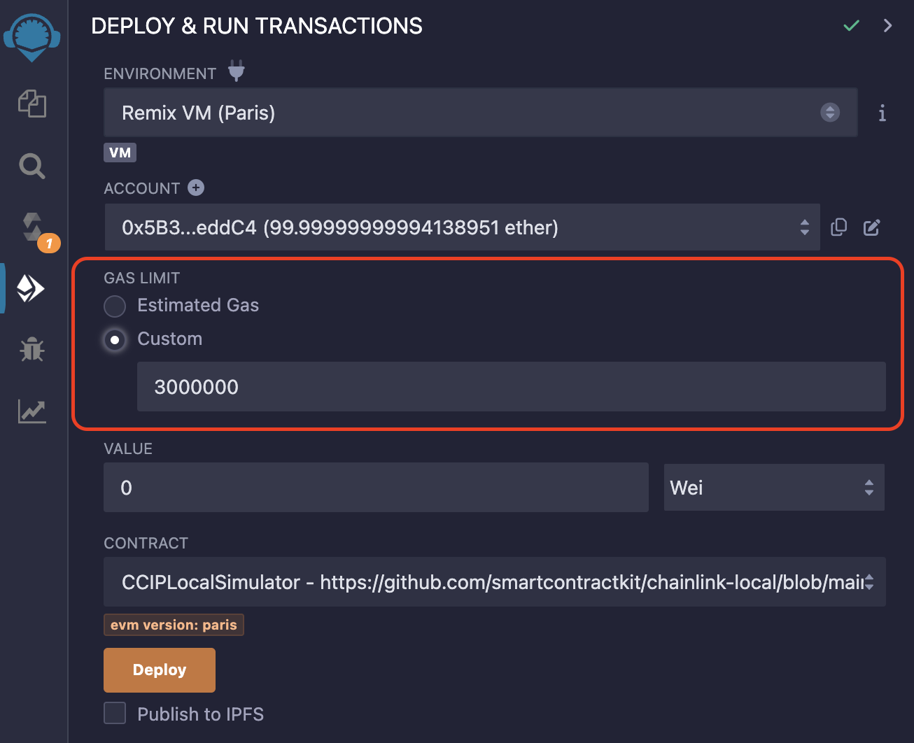

## Chainlink Local Documentation

Chainlink Local is a simulator for developers to be able to use Chainlink CCIP locally in Hardhat and Foundry. It is a set of smart contracts and scripts that aims to enable you to build, deploy and execute CCIP token transfers and arbitrary messages on a local Hardhat or Anvil (Foundry) node, both with and without forking.

User Contracts tested with Chainlink Local can be deployed to test networks without any modifications.

## Architecture

The simulator supports two modes:

1. working with mock contracts on a locally running development blockchain node running on `localhost`, and
2. working with deployed Chainlink CCIP contracts using multiple [forked networks](https://hardhat.org/hardhat-network/docs/guides/forking-other-networks).

### Local Simulator Mode

When working in local simulation mode, the simulator pre-deploys a set of smart contracts to a blank Hardhat/Anvil network EVM state and exposes their details via a call to the `configuration()` function (see `./src/ccip/CCIPLocalSimulator.sol`). Even though there are two Router contracts exposed, `sourceRouter` and `destinationRouter`, to support the developer's mental model of routing cross-chain messages through two different Routers, both are actually the same contract running on the locally development blockchain node.

### Local Forked Mode

When working in fork mode, we create multiple locally running blockchain networks (you need an archive node that has historical network state in the pinned block from which you have forked for local development - see [here](https://hardhat.org/hardhat-network/docs/guides/forking-other-networks)) and interact with the contract addresses provided in the [Official Chainlink Documentation](https://docs.chain.link/ccip).

CCIP Local Simulator Fork (smart contract for Foundry, and typescript script for Hardhat) exposes functionality to switch between forks and route messages to the destination blockchain.

## API Reference

### `CCIPLocalSimulator.sol` (Foundry & Hardhat)

To use Chainlink Local in a localhost environment in any smart contract development framework, user must import the `CCIPLocalSimulator.sol` singleton contract from the `@chainlink/local` package. Then deploy it on your local development network, and after that the simulator is ready for usage.

#### Foundry:

```solidity
pragma solidity ^0.8.19;

import {CCIPLocalSimulator} from "@chainlink/local/src/ccip/CCIPLocalSimulator.sol";

contract Demo is Test {
    CCIPLocalSimulator public ccipLocalSimulator;

    function setUp() public {
        ccipLocalSimulator = new CCIPLocalSimulator();

        (
            uint64 chainSelector,
            IRouterClient sourceRouter,
            IRouterClient destinationRouter,
            WETH9 wrappedNative,
            LinkToken linkToken,
            BurnMintERC677Helper ccipBnM,
            BurnMintERC677Helper ccipLnM
        ) = ccipLocalSimulator.configuration();

    }
}
```

#### Hardhat:

Create `CCIPLocalSimulator.sol` file inside the `contracts` folder and paste the following code:

```solidity
pragma solidity ^0.8.19;

import {CCIPLocalSimulator} from "@chainlink/local/src/ccip/CCIPLocalSimulator.sol";
```

And then use it inside your JavaScript/TypeScript tests and scripts:

```typescript
async function deploy() {
  const localSimulatorFactory = await ethers.getContractFactory("CCIPLocalSimulator");
  const localSimulator = await localSimulatorFactory.deploy();

  const config: {
    chainSelector_: bigint;
    sourceRouter_: string;
    destinationRouter_: string;
    wrappedNative_: string;
    linkToken_: string;
    ccipBnM_: string;
    ccipLnM_: string;
  } = await localSimulator.configuration();

  return { localSimulator };
}
```

#### Remix IDE:

Create `CCIPLocalSimulator.sol` and paste the following code:

```solidity
pragma solidity ^0.8.19;

import {CCIPLocalSimulator} from  "https://github.com/smartcontractkit/chainlink-local/blob/main/src/ccip/CCIPLocalSimulator.sol";
```

Compile it and deploy it to RemixVM. If deployment fails, go back to the "Solidity compiler" tab, toggle the "Advanced Configurations" and under "Compiler configuration" check the "Enable optimization" check box. Then compile it and try deploying it again.



After that deploy your smart contracts using addresses provided by the `configuration()` function (Router, LinkToken, etc.) and start interacting and testing your smart contracts.

If you encounter the `NotEnoughGasForCall` custom error provided by the Router smart contract, scroll up to the "Gas Limit" section, select the "Custom" radio button and try again.



#### [CCIPLocalSimulator].configuration()

Call the `.configuration()` method on the deployed `CCIPLocalSimulator` [contract](./src/ccip/CCIPLocalSimulator.sol) to obtain the configuration details for pre-deployed contracts and services needed for local CCIP simulations.

##### Return values:

- `chainSelector_` (uint64): The unique CCIP Chain Selector.
- `sourceRouter_` (IRouterClient): The source chain Router contract.
- `destinationRouter_` (IRouterClient): The destination chain Router contract.
- `wrappedNative_` (WETH9): The wrapped native token which can be used for CCIP fees.
- `linkToken_` (LinkToken): The LINK token.
- `ccipBnM_` (BurnMintERC677Helper): The ccipBnM token.
- `ccipLnM_` (BurnMintERC677Helper): The ccipLnM token.

See the code snippets in [Foundry](#foundry) and [Hardhat](#hardhat) above for usage.

#### [CCIPLocalSimulator].requestLinkFromFaucet()

```solidity
function requestLinkFromFaucet(address to, uint256 amount) external returns (bool success);
```

Requests LINK tokens from the faucet. The provided amount of tokens are transferred to provided destination address.

##### Parameters:

- `to` (address): The address to which LINK tokens are to be sent.
- `amount` (uint256): The amount of LINK tokens to send.

##### Return values:

- `success` (bool): Returns `true` if the transfer of tokens was successful, otherwise `false`.

#### [CCIPLocalSimulator].getSupportedTokens()

```solidity
function getSupportedTokens(uint64 chainSelector) external view returns (address[] memory tokens);
```

Gets a list of token addresses that are supported for cross-chain transfers by the simulator.

##### Parameters:

- `chainSelector` (uint64): The unique CCIP Chain Selector.

##### Return values:

- `tokens` (address[]): Returns a list of token addresses that are supported for cross-chain transfers by the simulator.

#### [CCIPLocalSimulator].isChainSupported()

```solidity
function isChainSupported(uint64 chainSelector) public pure returns (bool supported);
```

Checks whether the provided `chainSelector` is supported by the simulator.

##### Parameters:

- `chainSelector` (uint64): The unique CCIP Chain Selector.

##### Return values:

- `supported` (bool): Returns true if `chainSelector` is supported by the simulator.

#### [CCIPLocalSimulator].supportNewToken()

```solidity
function supportNewToken(address tokenAddress) external;
```

Allows user to support any new token, besides CCIP BnM and CCIP LnM, for cross-chain transfers.

##### Parameters:

- `tokenAddress` (address): The address of the token to add to the list of supported tokens.

---

### `CCIPLocalSimulatorFork.sol` (Foundry only)

Note: the RPC URLs here must point to [archive nodes](https://docs.alchemy.com/docs/what-is-archive-data-on-ethereum#:~:text=Archive%20nodes%20store%20the%20same,%2C%20technical%20expertise%2C%20and%20experience.).

[Foundry Fork-Testing Guide](https://book.getfoundry.sh/forge/fork-testing)

Note also that in Foundry, [scripts are generally written in Solidity](https://book.getfoundry.sh/tutorials/solidity-scripting), which may be different from what you've come to expect after using tools like Hardhat.

```solidity
pragma solidity ^0.8.19;

import {CCIPLocalSimulatorFork} from "@chainlink/local/src/ccip/CCIPLocalSimulatorFork.sol";

contract Demo is Test {
    CCIPLocalSimulatorFork public ccipLocalSimulatorFork;

    uint256 sepoliaFork;
    uint256 arbSepoliaFork;

    function setUp() public {
        string memory ETHEREUM_SEPOLIA_RPC_URL = vm.envString("ETHEREUM_SEPOLIA_RPC_URL");
        string memory ARBITRUM_SEPOLIA_RPC_URL = vm.envString("ARBITRUM_SEPOLIA_RPC_URL");
        sepoliaFork = vm.createSelectFork(ETHEREUM_SEPOLIA_RPC_URL);
        arbSepoliaFork = vm.createFork(ARBITRUM_SEPOLIA_RPC_URL);

        ccipLocalSimulatorFork = new CCIPLocalSimulatorFork();
        vm.makePersistent(address(ccipLocalSimulatorFork));
    }

    function testDemo() public {
        sender.transferTokensPayLINK(arbSepoliaChainSelector, alice, address(ccipBnM), amountToSend);
        ccipLocalSimulatorFork.switchChainAndRouteMessage(arbSepoliaFork);
    }
}
```

#### [CCIPLocalSimulatorFork].switchChainAndRouteMessage()

```solidity
function switchChainAndRouteMessage(uint256 forkId) external;
```

To be called after the sending of the cross-chain message (`ccipSend`). Goes through the list of past logs and looks for the `CCIPSendRequested` event. Switches to a destination network fork. Routes the sent cross-chain message on the destination network.

##### Parameters:

- `forkId` (uint256) - The ID of the destination network fork. This is the returned value of `createFork()` or `createSelectFork()`

#### [CCIPLocalSimulatorFork].requestLinkFromFaucet()

```solidity
function requestLinkFromFaucet(address to, uint256 amount) external returns (bool success);
```

Requests LINK tokens from the faucet. The provided amount of tokens are transferred to provided destination address.

##### Parameters:

- `to` (address): The address to which LINK tokens are to be sent.
- `amount` (uint256): The amount of LINK tokens to send.

##### Return values:

- `success` (bool): Returns `true` if the transfer of tokens was successful, otherwise `false`.

#### [CCIPLocalSimulatorFork].getNetworkDetails()

```solidity
function getNetworkDetails(uint256 chainId) external view returns (Register.NetworkDetails memory);
```

Returns the default values for currently CCIP supported networks. If network is not present or some of the values are changed, user can manually add new network details using the `setNetworkDetails` function.

##### Parameters:

- `chainId` (uint256) - The blockchain network chain ID. For example 11155111 for Ethereum Sepolia. Not CCIP chain selector.

##### Return values:

- Tuple containing:
  - `chainSelector` (uint64) - The unique CCIP Chain Selector.
  - `routerAddress` (address) - The address of the CCIP Router contract.
  - `linkAddress` (address) - The address of the LINK token.
  - `wrappedNativeAddress` (address) - The address of the wrapped native token that can be used for CCIP fees.
  - `ccipBnMAddress` (address) - The address of the CCIP BnM token.
  - `ccipLnMAddress` (address) - The address of the CCIP LnM token.

#### [CCIPLocalSimulatorFork].setNetworkDetails()

```solidity
unction setNetworkDetails(uint256 chainId, Register.NetworkDetails memory networkDetails) external;
```

If network details are not present or some of the values are changed, user can manually add new network details using the `setNetworkDetails` function.

##### Parameters:

- `chainId` (uint256) - The blockchain network chain ID. For example 11155111 for Ethereum Sepolia. Not CCIP chain selector.
- Tuple containing:
  - `chainSelector` (uint64) - The unique CCIP Chain Selector.
  - `routerAddress` (address) - The address of the CCIP Router contract.
  - `linkAddress` (address) - The address of the LINK token.
  - `wrappedNativeAddress` (address) - The address of the wrapped native token that can be used for CCIP fees.
  - `ccipBnMAddress` (address) - The address of the CCIP BnM token.
  - `ccipLnMAddress` (address) - The address of the CCIP LnM token.

---

### `CCIPLocalSimulatorFork.js` (Hardhat only)

```typescript
import { getEvm2EvmMessage, requestLinkFromTheFaucet, routeMessage } from "@chainlink/local/scripts/CCIPLocalSimulatorFork";

// 1st Terminal: npx hardhat node
// 2nd Terminal: npx hardhat run ./scripts/myScript.ts --network localhost

async function main() {
  const ETHEREUM_SEPOLIA_RPC_URL = process.env.ETHEREUM_SEPOLIA_RPC_URL; // Archive node
  const ARBITRUM_SEPOLIA_RPC_URL = process.env.ARBITRUM_SEPOLIA_RPC_URL; // Archive node

  await network.provider.request({
    method: "hardhat_reset",
    params: [
      {
        forking: {
          jsonRpcUrl: ETHEREUM_SEPOLIA_RPC_URL,
          blockNumber: 5663645,
        },
      },
    ],
  });

  const linkAmountForFees = 5000000000000000000n; // 5 LINK
  await requestLinkFromTheFaucet(linkTokenAddressSepolia, await CCIPSender_Unsafe.getAddress(), linkAmountForFees);

  const tx = await CCIPSender_Unsafe.send(CCIPReceiver_Unsafe.target, textToSend, arbSepoliaChainSelector, ccipBnMTokenAddressSepolia, amountToSend);
  const receipt = await tx.wait();
  if (!receipt) return;
  const evm2EvmMessage = getEvm2EvmMessage(receipt);

  console.log("-------------------------------------------");

  await network.provider.request({
    method: "hardhat_reset",
    params: [
      {
        forking: {
          jsonRpcUrl: ARBITRUM_SEPOLIA_RPC_URL,
          blockNumber: 33079804,
        },
      },
    ],
  });

  // We must redeploy it because of the network reset but it will be deployed to the same address because of the CREATE opcode: address = keccak256(rlp([sender_address,sender_nonce]))[12:]
  CCIPReceiver_Unsafe = await CCIPReceiver_UnsafeFactory.deploy(ccipRouterAddressArbSepolia);

  if (!evm2EvmMessage) return;
  await routeMessage(ccipRouterAddressArbSepolia, evm2EvmMessage);
}
```

#### [CCIPLocalSimulatorFork].requestLinkFromTheFaucet()

```typescript
async function requestLinkFromTheFaucet(linkAddress: string, to: string, amount: bigint): Promise<string>;
```

Requests LINK tokens from the faucet and returns the transaction hash.

##### Parameters:

- `linkAddress` (string) - The address of the LINK contract on the current network.
- `to` (string) - The address to send LINK to.
- `amount` (bigint) - The amount of LINK to request.

##### Return values:

- `Promise<string>` - Promise resolving to the transaction hash of the fund transfer.

#### [CCIPLocalSimulatorFork].getEvm2EvmMessage()

```typescript
function getEvm2EvmMessage(receipt: TransactionReceipt): Evm2EvmMessage | null;
```

Parses a transaction receipt to extract the sent message. Scans through transaction logs to find a `CCIPSendRequested` event and then decodes it to Evm2EvmMessage.

##### Parameters:

- `receipt` (TransactionReceipt) - The transaction receipt from the `ccipSend` call.

##### Return values:

- `Evm2EvmMessage | null` - Returns either the sent message or null if provided receipt does not contain `CCIPSendRequested` log.
  Evm2EvmMessage tuple:
  - `sourceChainSelector` (bigint)
  - `sender` (string)
  - `receiver` (string)
  - `sequenceNumber` (bigint)
  - `gasLimit` (bigint)
  - `strict` (boolean)
  - `nonce` (bigint)
  - `feeToken` (string)
  - `feeTokenAmount` (bigint)
  - `data` (string)
  - `tokenAmounts` ([])
  - `sourceTokenData` ([])
  - `messageId` (string)

#### [CCIPLocalSimulatorFork].routeMessage()

```typescript
async function routeMessage(routerAddress: string, evm2EvmMessage: Evm2EvmMessage): Promise<void>;
```

Routes the sent message from the source network (got it from the `getEvm2EvmMessage` function) on the destination (current) network.

##### Parameters:

- `routerAddress` (string) - The address of the destination Router contract (Router on the current network).
- `evm2EvmMessage` (Evm2EvmMessage) - Sent cross-chain message, (got from the `getEvm2EvmMessage` function).

##### Return values:

- `Promise<void>` - Either resolves with no value if the message is successfully routed, or reverts.

## Examples

You can check our current examples for reference:

- [Unsafe Token And Data Transfer Test in Foundry](./test/smoke/ccip/UnsafeTokenAndDataTransfer.t.sol)
- [Unsafe Token And Data Transfer Test in Hardhat](./test/smoke/ccip/UnsafeTokenAndDataTransfer.spec.ts)
- [Unsafe Token And Data Transfer Script in Hardhat](./scripts/examples/UnsafeTokenAndDataTransfer.ts)
- [Unsafe Token Transfer With Native Coin Test in Foundry](./test/smoke/ccip/PayWithNative.t.sol)
- [Ping Pong example Test in Foundry (Reply cross-chain messages)](./test/smoke/ccip/PingPong.t.sol)

And also recreated test examples in Foundry from the [Official Chainlink Documentation](https://docs.chain.link/ccip):

- [Token Transferor](./test/smoke/ccip/TokenTransferor.t.sol)
- [Programmable Token Transfers](./test/smoke/ccip/ProgrammableTokenTransfers.t.sol)
- [Programmable Token Transfers - Defensive Example](./test/smoke/ccip/ProgrammableDefensiveTokenTransfers.t.sol)

Forking examples with Foundry:

User must provide `ETHEREUM_SEPOLIA_RPC_URL` and `ARBITRUM_SEPOLIA_RPC_URL`.

- [Ping Pong example Fork Test in Foundry (Reply cross-chain messages)](./test/e2e/ccip/PingPongFork.t.sol)
- [Token Transferor Fork Test in Foundry](./test/e2e/ccip/TokenTransferorFork.t.sol)

Forking examples with Hardhat:

User must provide `ETHEREUM_SEPOLIA_RPC_URL` and `ARBITRUM_SEPOLIA_RPC_URL`.

- [Unsafe Token And Data Transfer Fork Script in Hardhat](./scripts/examples/UnsafeTokenAndDataTransferFork.ts)

To run this example:

1. In the first terminal window run: `npx hardhat node`
2. In the second terminal window run: `npx hardhat run ./scripts/examples/UnsafeTokenAndDataTransferFork.ts --network localhost`

## Contribute to Chainlink Local

### Build & Test

To get started:

- Clone this repo.
- Run `npm i && forge install` to install dependencies.
- Run `npx hardhat test` to run Hardhat tests.
- Run `forge test` to run Foundry tests.

### Contributing

Contributions are welcome, feel free to raise issues and/or open pull requests.

Thank you!
