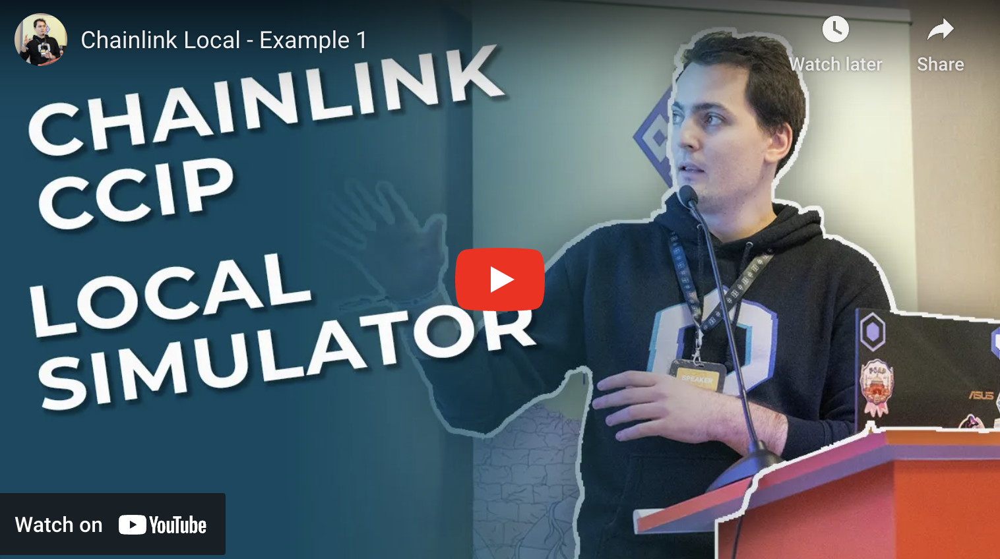

## Chainlink Local

Chainlink Local is an installable dependency. It provides a tool (the Chainlink Local Simulator) that developers import into their Foundry or Hardhat or Remix projects. This tool runs [Chainlink CCIP](https://docs.chain.link/ccip) locally which means developers can rapidly explore, prototype and iterate CCIP dApps off-chain in a local environment, and move to testnet only when they're ready to test in a live environment.

The package exposes a set of smart contracts and scripts with which you build, deploy and execute CCIP token transfers and arbitrary messages on a local Remix, Hardhat or Anvil (Foundry) development node. Chainlink Local also supports forked nodes.

User Contracts tested with Chainlink Local can be deployed to test networks without any modifications (assuming network specific contract addresses such as Router contracts and LINK token addresses are passed in via a constructor).

To view more detailed documentation and more examples, visit the [Chainlink Local Documentation](https://cll-devrel.gitbook.io/chainlink-local-documentation).

<p align="center">
  <a href="https://www.youtube.com/watch?v=rEVjU9tOf74&list=PL3ZUTf1nxlFyHKswTYFa2tffUsR94KAEv">
    
  </a>
</p>

### Installation

Install the package by running:

#### Foundry (git)

```
forge install smartcontractkit/chainlink-local
```

and then set remappings to: `@chainlink/local/=lib/chainlink-local/` in either `remappings.txt` or `foundry.toml` file

#### Hardhat (npm)

```
npm install @chainlink/local
```

#### Remix IDE

```solidity
import "https://github.com/smartcontractkit/chainlink-local/blob/main/src/ccip/CCIPLocalSimulator.sol";
```

Once you have installed CCIP Local, you are now ready to start using it with your project.

### Usage

Import `CCIPLocalSimulator.sol` inside your tests or scripts, for example:

```solidity
// test/demo.t.sol

pragma solidity ^0.8.19;

import {Test, console2} from "forge-std/Test.sol";
import {IRouterClient, WETH9, LinkToken, BurnMintERC677Helper} from "@chainlink/local/src/ccip/CCIPLocalSimulator.sol";
import {CCIPLocalSimulator} from "@chainlink/local/src/ccip/CCIPLocalSimulator.sol";

contract Demo is Test {
    CCIPLocalSimulator public ccipLocalSimulator;

    function setUp() public {
        ccipLocalSimulator = new CCIPLocalSimulator();

        (
            uint64 chainSelector,
            IRouterClient sourceRouter,
            IRouterClient destinationRouter,
            WETH9 wrappedNative,
            LinkToken linkToken,
            BurnMintERC677Helper ccipBnM,
            BurnMintERC677Helper ccipLnM
        ) = ccipLocalSimulator.configuration();


        ccipLocalSimulator.requestLinkFromFaucet(receiver, amount);
    }

}
```

### Learn more

To view detailed documentation and more examples, visit the [Chainlink Local Documentation](https://cll-devrel.gitbook.io/chainlink-local-documentation).

> **Note**
>
> _This tutorial represents an educational example to use a Chainlink system, product, or service and is provided to demonstrate how to interact with Chainlink’s systems, products, and services to integrate them into your own. This template is provided “AS IS” and “AS AVAILABLE” without warranties of any kind, it has not been audited, and it may be missing key checks or error handling to make the usage of the system, product or service more clear. Do not use the code in this example in a production environment without completing your own audits and application of best practices. Neither Chainlink Labs, the Chainlink Foundation, nor Chainlink node operators are responsible for unintended outputs that are generated due to errors in code._
